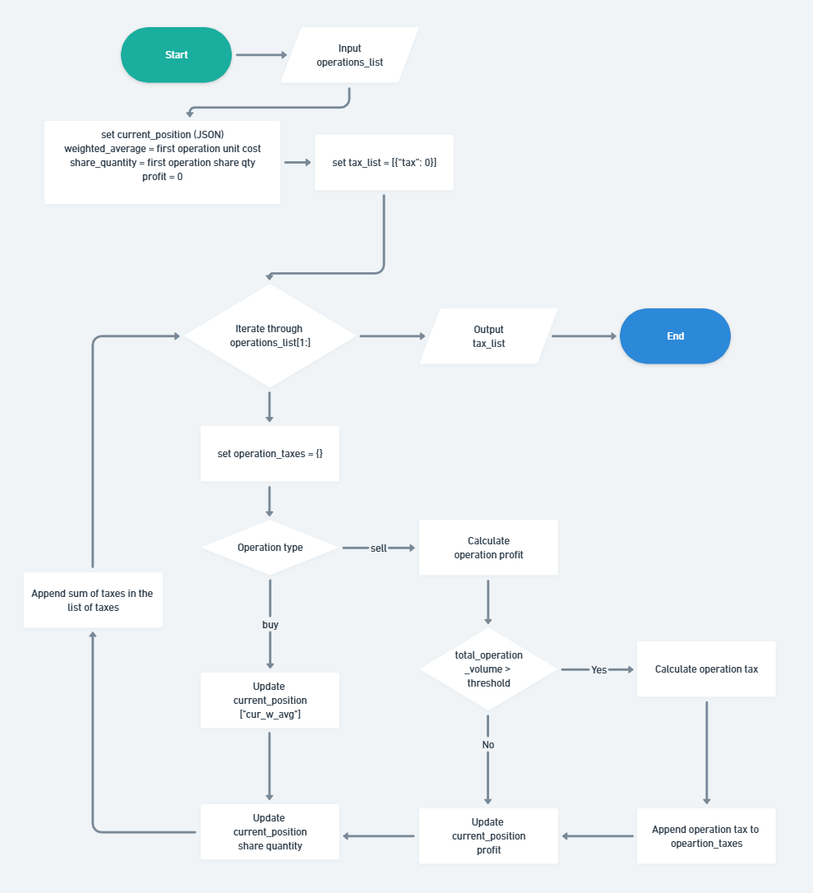

Here's a clean and informative `README.md` for your CLI-based tax calculation program, explaining its purpose, usage, and structure:

---

# Market Operations Tax Calculator

This Python program calculates taxes on stock market operations using weighted average price and tax rules for large sell operations.

## What It Does

Given a list of **buy** and **sell** operations, it calculates:

* The **weighted average cost** of shares.
* The **profit or loss** of each sell operation.
* The **tax** owed on each sell, applying a 20% tax rate **only if**:

  * The operation is a **sell**, **and**
  * The total volume of the sell exceeds **R\$ 20,000.00**, and
  * There is **positive profit**, after offsetting prior losses.

## Input Format

The program reads **one JSON list of operations per line from standard input**. Each operation must follow this structure:

```json
{
  "operation": "buy" | "sell",
  "unit-cost": float,
  "quantity": int
}
```

### Example Input (one line):

```json
[{"operation": "buy", "unit-cost": 10.00, "quantity": 10000}, {"operation": "sell", "unit-cost": 20.00, "quantity": 5000}]
```

You can also pass multiple lines like this:

```bash
python main.py <<EOF
[{"operation": "buy", "unit-cost": 10.00, "quantity": 10000}, {"operation": "sell", "unit-cost": 20.00, "quantity": 5000}]
[{"operation": "buy", "unit-cost": 20.00, "quantity": 10000}, {"operation": "sell", "unit-cost": 10.00, "quantity": 5000}]
EOF
```

## Output Format

For each input line, a JSON list is printed to stdout, showing the tax amount for each operation (always `"0.00"` for the first buy):

```json
[{"tax": "0.00"}, {"tax": "10000.00"}]
[{"tax": "0.00"}, {"tax": "0.00"}]
```

## Program Structure

* `main.py`: The CLI entry point.
* `utils/`:

  * `decorators.py`: Decorators like `@round_decimal_output()` to round Decimal results.
  * `json_utils.py`: Custom JSON serializer for `Decimal` values.

### Key Functions

* `calculate_weighted_avg(...)`: Computes the new average price after a buy.
* `calculate_sell_operation_profit(...)`: Computes profit for a sell.
* `calculate_tax_on_large_operation(...)`: Applies tax if above R\$20k threshold.
* `get_market_operations_tax_list(...)`: Core logic to iterate operations and return the tax list.

## Notes

* All monetary values use the `Decimal` type for precision.
* Outputs are rounded to **two decimal places**, in string format.

## Tests

Unit and integration tests were written using `pytest`. 

To run the tests pytest needs to be installed:

```bash
pip install pytest
```

To run the unit tests:

```bash
pytest -v
```

To run the integration tests:

```bash
pytest -v tests/tests_integration.py
```

## Running the Program

With python 3.10+ :

```bash
python main.py <<EOF
[{"operation": "buy", "unit-cost": 10.00, "quantity": 10000}, {"operation": "sell", "unit-cost": 20.00, "quantity": 5000}]
[{"operation": "buy", "unit-cost": 20.00, "quantity": 10000}, {"operation": "sell", "unit-cost": 10.00, "quantity": 5000}]
EOF
```

## Working principle diagram (in progress)


